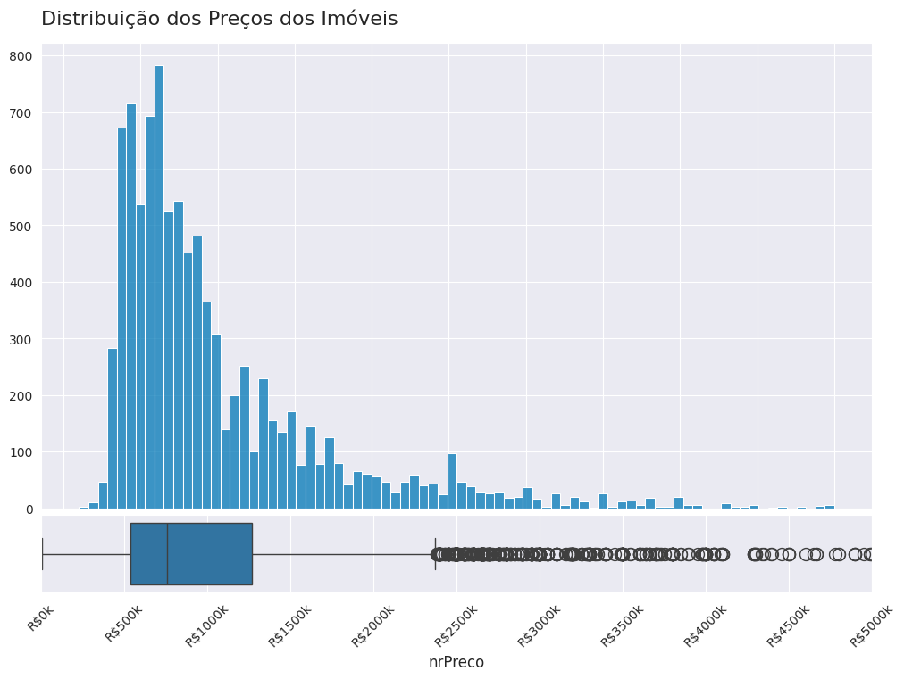
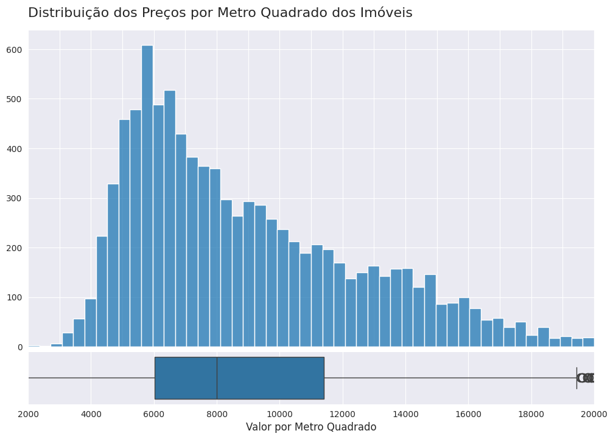
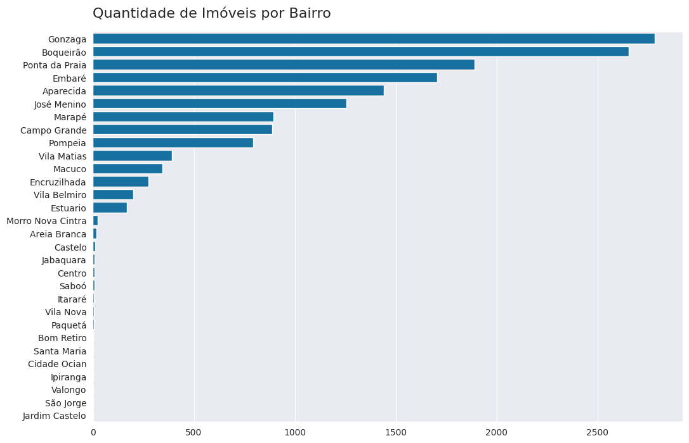
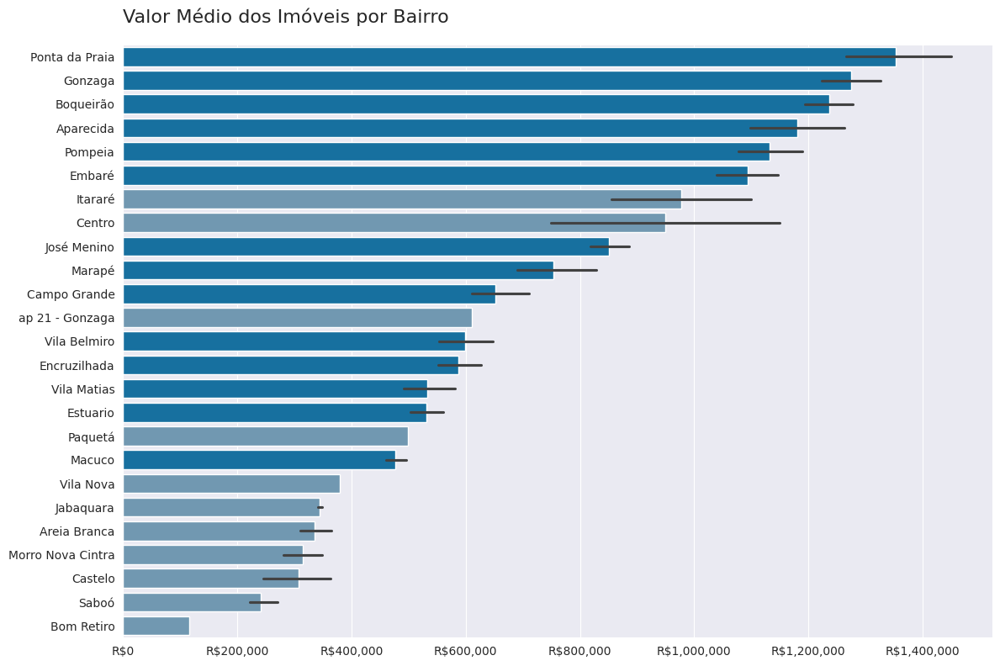
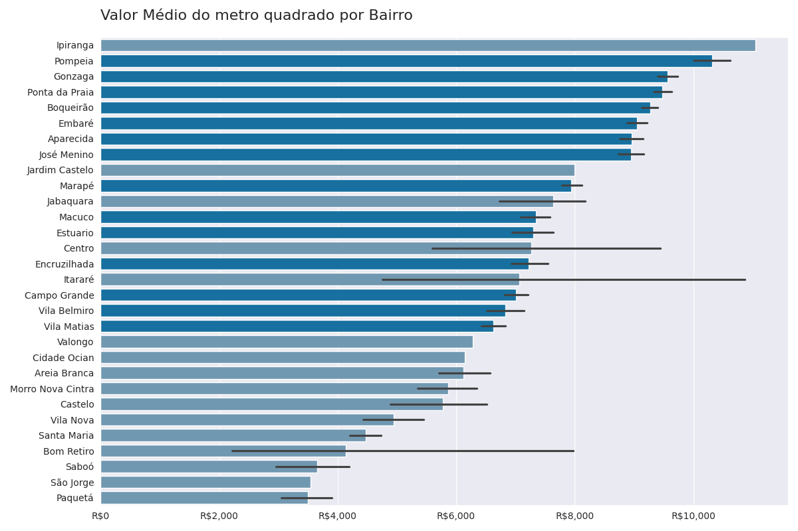
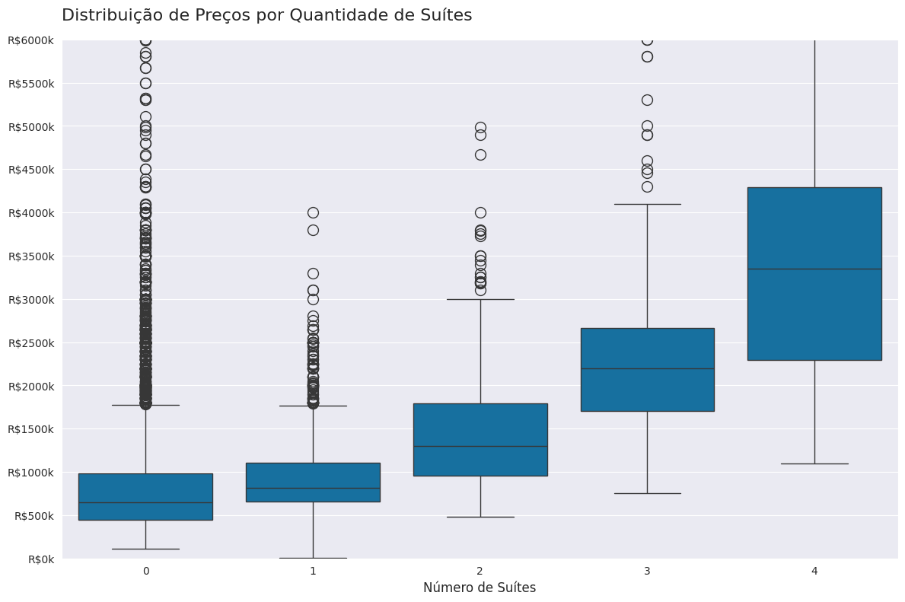
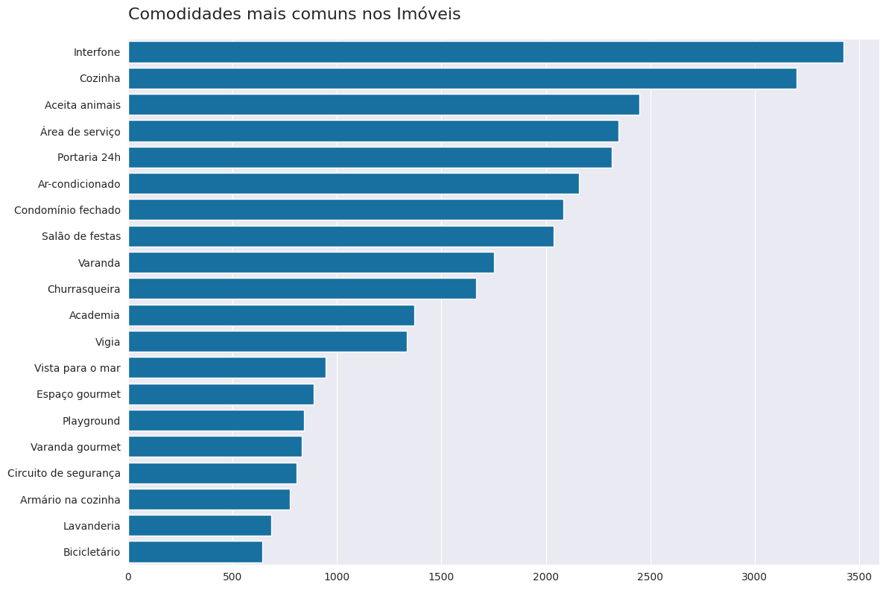
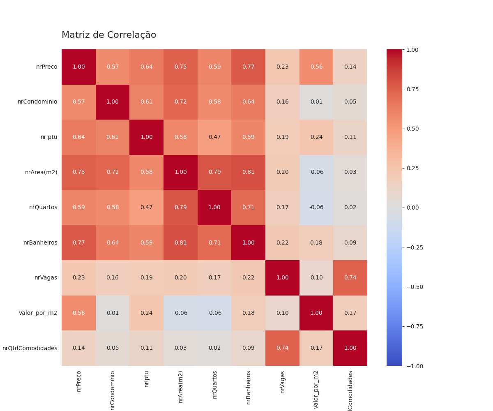
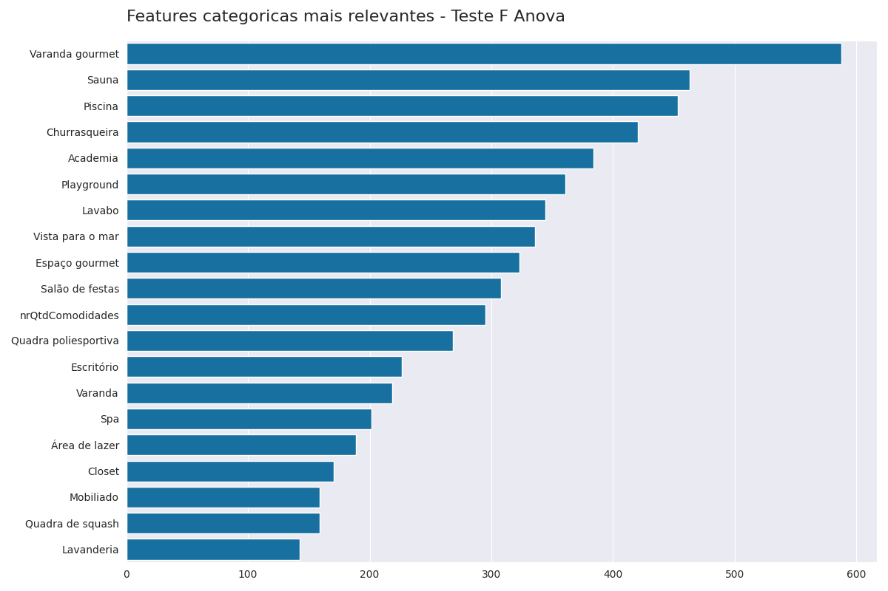

# 🏠 Predição de Preços de Apartamentos em Santos [EM ANDAMENTO]

🖼️🚧*Em Andamento*🚧🖼️


|               |             |
| -----------   | -----------    |
| Autor         | [Matheus Santos](https://www.linkedin.com/in/mathsantos94/) |
| Modelo        | Precificação    |
| Linguagem    | Python    |
| EDA | [Notebook](notebooks/eda.ipynb) |

## 📌 Visão geral 
Esse projeto teve como objetivo analisar o panorama geral dos apartamentos de Santos/SP e criar um modelo preditivo de preços. Foram utilizadas técnicas de análise de dados e Machine Learning para extrair insights, identificar padrões de mercado e construir um modelo capaz de prever o valor de imóveis com base em suas características.

### Objetivos Específicos

- Coletar e tratar dados de apartamentos disponíveis no site da [ZapImoveis](https://www.zapimoveis.com.br/) na cidade de Santos.

- Realizar análise exploratória para entender os principais fatores que influenciam o preço.

- Criar variáveis relevantes atráves de feature engineering  para o modelo.

- Testar diferentes algoritmos de regressão.

- Avaliar o desempenho dos modelos utilizando métricas apropriadas (ex: RMSE, MAPE, R²).

- Implementar um serviço de inferência usando StreamLit para realizar previsões em tempo real.

### 🔍 Tecnologias Utilizadas

- Python (Selenium, Pandas, NumPy, Scikit-learn, Matplotlib, Seaborn)

- Machine Learning: Regressão Linear, Decision Tree, Random Forest, CatBoost, LGBM

- StreamLit

## 🧭 Entendimento do Negócio

O mercado imobiliário da cidade de Santos/SP é um dos mais valorizados do litoral paulista, com grande diversidade de imóveis em termos de metragem, localização e infraestrutura. No entanto, a precificação de apartamentos ainda é altamente subjetiva, sendo influenciada por fatores como bairro, proximidade da praia, quantidade de dormitórios, vagas de garagem e padrão de acabamento.

Nesse contexto, um modelo preditivo pode atuar como uma ferramenta de apoio à decisão, ajudando stakeholders a:

- Avaliar rapidamente o valor estimado de um imóvel.
- Identificar quais características mais impactam o preço.
- Automatizar análises comparativas de imóveis para leads ou clientes.

O objetivo deste projeto é justamente preencher essa lacuna, utilizando dados históricos de anúncios e técnicas de Machine Learning para construir um modelo robusto de avaliação automática de apartamentos em Santos.

## ⚠️ Premissas

Este projeto foi desenvolvido com base em dados reais coletados do portal ZapImóveis, focando exclusivamente em anúncios de apartamentos localizados na cidade de Santos/SP. No entanto, algumas premissas importantes devem ser consideradas:
1. **Preço Anunciado x Preço Real de Venda**

    Os preços utilizados representam os valores anunciados no portal, e não necessariamente os preços finais de negociação. Isso implica que os dados podem conter distorções, como superavaliações ou estratégias de precificação que não refletem o valor de mercado efetivo.

2. **Outliers e Supervalorização**

    É comum encontrar imóveis com preços excessivamente altos devido a características específicas ou supervalorização subjetiva. Tais observações foram tratadas com técnicas estatísticas para reduzir seu impacto no modelo preditivo, mas ainda podem influenciar os resultados.

3. **Atualização e Temporalidade dos Dados**

    Os dados representam um recorte temporal específico e não são atualizados em tempo real. O mercado imobiliário é dinâmico e sujeito a sazonalidades, variações econômicas e políticas públicas, o que pode afetar a acurácia do modelo com o tempo.

## 💡 Análise Exploratória
[📘 Notebook - EDA](notebooks/eda.ipynb)

Após a leitura dos dados brutos, foram realizados os tratamentos necessários para realizar a análise dos dados como:

- **Padronização dos nomes das colunas**: Os nomes das colunas foram padronizados para o português, facilitando a interpretação e o uso das variáveis ao  longo da análise.

- **Tratamento de valores duplicados**: Removemos as amostras duplicadas para garantir que cada registro no dataset seja único. Isso é importante para evitar que registros repetidos distorçam os resultados das análises. 

- **Tratamento de valores ausentes**: Os valores ausentes foram preenchidos com 0. Essa abordagem foi adotada para evitar problemas em análises futuras, mas é importante avaliar se essa substituição faz sentido para cada variável. Os valores ausentes nesse dataset são devidos a falta de preenchimento da caracteristica do imóvel.

- **Limpeza de variáveis quantitativas**: As variáveis quantitativas foram convertidas para o tipo `int`, removendo caracteres não numéricos e preenchendo valores ausentes com `0`. Essa etapa é essencial para garantir que os dados estejam no formato correto para análises numéricas.

- **Tratamento de outliers**: Os valores extremos podem distorcer as análises e foram tratados utilizando a técnica ***Winsorizer*** da biblioteca *feature-engine*. Foi adotado o método de limitação baseado no MAD (Median Absolute Deviation), em que valores acima ou abaixo de 3.29 vezes o desvio absoluto da mediana (em relação à própria mediana) foram substituídos pelos limites superior e inferior definidos. Essa abordagem preserva as observações na base de dados, evitando o descarte de registros e reduzindo o impacto de outliers sem comprometer a robustez estatística.

- **Codificação de variáveis categóricas**: Utilizamos o método `get_dummies()` para transformar variáveis categóricas em variáveis dummy. Essa transformação é necessária para que essas variáveis possam ser utilizadas em análises estatísticas.

- **Criação de novas variáveis**: Criamos novas variáveis para enriquecer a análise
    - **`valor_por_m2`**: Representa o valor por metro quadrado, permitindo comparar imóveis de diferentes tamanhos. (**Essa variável não irá para o modelo de treinamento pois iria causar um vazamento do nosso target**)
    - **`nrQtdComodidades`**: Representa o número total de comodidades disponíveis em cada imóvel.

---

Após extensiva parte de tratamento, realizamos enfim a análise explorátoria dos dados onde observamos os seguintes aspectos:

### Distribuição de preços

Visualizamos a distribuição dos preços dos imóveis. Essa análise ajuda a identificar a faixa de preços mais comum e a presença de valores extremos.



Vêmos que mesmo utilizando a técnica de *Winsorizer* ainda permanecem muitos valores extremos. Deixaremos esses valores como estão mas iremos nos atentar as análises.

### Distribuição de preços por metro quadrado

Analisamos a distribuição dos preços por metro quadrado. Essa métrica é importante para entender como o custo do espaço varia entre os imóveis.



### Bairros com mais apartamentos a venda

Identificamos os bairros com maior número de imóveis disponíveis. Essa análise ajuda a entender a distribuição dos dados e a representatividade de cada bairro no dataset.



Como podemos ver, alguns possuem poucas amostras disponiveis, e não podem ser considerados representativos pois podem dificultar uma comparação justa com os bairros mais bem representados. Logo irei destacar esses bairros nos próximos gráficos para representar que suas amostras são limitadas.

### Valor médio dos imóveis por bairro

Analisamos o valor médio dos imóveis em cada bairro. Essa análise destaca quais bairros possuem os imóveis mais caros e mais acessíveis, fornecendo insights sobre o mercado imobiliário local.



### Preço por metro quadrado por bairro

Calculamos o preço médio por metro quadrado em cada bairro. Essa métrica é útil para comparar o custo-benefício de imóveis em diferentes regiões.



### Preço por suítes

Exploramos como o número de suítes impacta o preço dos imóveis. Essa análise ajuda a identificar se imóveis com mais suítes possuem preços significativamente mais altos.



### Frequência de comodidades

Identificamos as comodidades mais comuns nos imóveis. Essa análise ajuda a entender o que é mais valorizado pelos compradores e quais características são mais frequentes no mercado.



### Matriz de correlação

A matriz de correlação nos ajuda a identificar a relação entre as variáveis numéricas do dataset. Valores próximos de 1 indicam uma forte correlação positiva, enquanto valores próximos de -1 indicam uma forte correlação negativa.



Essa análise nos mostra que temos valores que impactam positivamente a variável target `nrPreco`, como a quantidade de banheiros do imóvel (`nrBanheiros`),o tamanho do imóvel (`nrTamanho(m2)`) e a quantidade de vagas (`nrVagas`). Porém, é necessario ter atenção a variáveis que possuem multicolinearidade como `condominio` x `nrTamanho(m2)`, `nrTamanho(m2)` x `nrQuartos` e `nrTamanho(m2)` x `nrBanheiros`.

### Teste F ANOVA

Uma maneira mais eficaz de avaliar a associação entre as variáveis e uma resposta categórica é por meio do teste F ANOVA. Esse teste estatístico mede a variabilidade entre os grupos em relação à variabilidade dentro dos próprios grupos, permitindo identificar quais características possuem maior impacto na variável alvo. Dessa forma, conseguimos selecionar as features mais relevantes para a modelagem, melhorando a performance do modelo e reduzindo a dimensionalidade dos dados.



## 🤖 Modelagem Preditiva

Após entender os dados e realizar a etapa de tratamento e exploração, passei para a fase de construção do modelo preditivo. Essa etapa seguiu uma estrutura clara e modular, com foco na reprodutibilidade e na robustez estatística.

1. **Separação entre treino e teste**  
   Dividi a base de dados em treino (70%) e teste (30%) utilizando a função `train_test_split`. Essa divisão permite avaliar o desempenho real do modelo em dados nunca vistos.

2. **Pipeline de Preparação**  
    Utilizei um Pipeline do Scikit-Learn para encadear todas as etapas de transformação dos dados antes do treinamento do modelo. Isso garante consistência entre os dados de treino e teste, evita data leakage e facilita a replicação do projeto.

| Etapa            |Descrição                                                                                                      |
| ---------------- | -------------------------------------------------------------------------------------------------------------- |
| `Winsorizer`     | Tratamento de outliers com base no desvio absoluto da mediana (MAD), reduzindo o impacto de valores extremos.  |
| `OneHotEncoder`  | Codificação de variáveis categóricas, transformando-as em dummies para uso nos modelos.                        |
| `NewFeats`    | Criação de novas variáveis como número total de comodidades e indicadores binários para categorias.            |
| `RFE`            | Seleção das variáveis mais relevantes usando o método de eliminação recursiva (Recursive Feature Elimination). |
| `StandardScaler` | Padronização das variáveis numéricas para média 0 e desvio padrão 1, útil para modelos sensíveis à escala.     |


3. **Modelos Avaliados**  
   Testei diferentes algoritmos de regressão, sempre utilizando validação cruzada para avaliar sua performance:

   - Regressão Linear
   - Random Forest
   - LightGBM
   - CatBoost Regressor (modelo final)

4. **Métricas de Avaliação**
   Utilizei as seguintes métricas:

   - **RMSE (Root Mean Squared Error)**: penaliza mais os grandes erros.
   - **MAE (Mean Absolute Error)**: interpretação direta do erro médio absoluto.
   - **R² Score**: proporção da variância explicada pelo modelo.

   O **RMSE**, apesar de ser uma métrica muito utilizada, é extremamente sensível a outlies, já que eleva ao quadrado os erros. Isso significa que uma única previsão com grande erro pode distorcer drasticamente o RMSE e mascarar o desempenho geral do modelo.
   
   Já o **MAE**, por tratar todos os erros de forma linear e não amplificar outliers, fornece uma visão mais realista e robusta da performance preditiva na maioria dos casos. Para um caso de uso como este — estimar o valor anunciado de imóveis, onde erros muito grandes podem ocorrer mas não devem dominar a métrica — o MAE se mostrou mais confiável e interpretável.


5. **Validação e Monitoramento**
   - Empreguei validação cruzada K-Fold (5-fold) para garantir a robustez do modelo.
   - Utilizei o MLflow para rastreamento automático de experimentos, armazenando:

        - Parâmetros dos modelos
        - Métricas de desempenho
        - Gráficos

6. **Modelo Final**

    O modelo CatBoostRegressor, encapsulado dentro de um pipeline completo de pré-processamento e seleção de variáveis, apresentou o melhor equilíbrio entre desempenho e generalização.

    Utilizando validação cruzada com 5 folds, o modelo obteve um **MAE** médio de **R$ 144.780,41**, demonstrando estabilidade durante o treinamento. Já no conjunto de teste — composto por dados completamente não vistos — o erro absoluto médio foi de **R$ 152.156,70**, indicando baixa variância entre treino e teste e confirmando a capacidade do modelo de generalizar para novos dados.

## ⚙️ Instalação do projeto

**Pré-requisitos**:
Antes de começar, tenha certeza que você tem instalado em sua maquina:

- Python 3.10
- pip
- Git

Uma vez instalado, abra o terminal na sua maquina local e siga os passos:

1. Clone o repositorio

```
git clone https://github.com/Mathsnts18/SantosApartmentPricing.git
```
2. Vá ao diretório clonado

```
cd SantosApartmentPricing
```

3. Crie um ambiente virtual

```
python -m venv venv
```

4. Ative o ambiente virtual

Ative o ambiente virtual para isolar as dependências do projeto
```
# no Windows
venv\Scripts\activate

# no Linux
source venv/bin/activate
```

<!-- 5. Instale as dependências

Use o pip para instalar as dependências listadas no requirements.txt

```
pip install -r requirements.txt
```

6. Execute a aplicação

```
streamlit run app.py
```
Após a execução, o projeto irá abrir automaticamente. Caso isso não aconteça, digite na barra de endereço do seu navegar o `Local URL` informado no terminal

7. Desligue a aplicação

Para desligar a aplicação, dê o comando `Ctrl+C` no terminal que estiver rodando a aplicação.

8. Desative o ambiente virtual

Quando terminar de ver o projeto, desative o ambiente virtual

```
deactivate
``` -->

## Contato

Portfólio: https://www.matheussantos.com.br/

Linkedin: https://www.linkedin.com/in/mathsantos94/